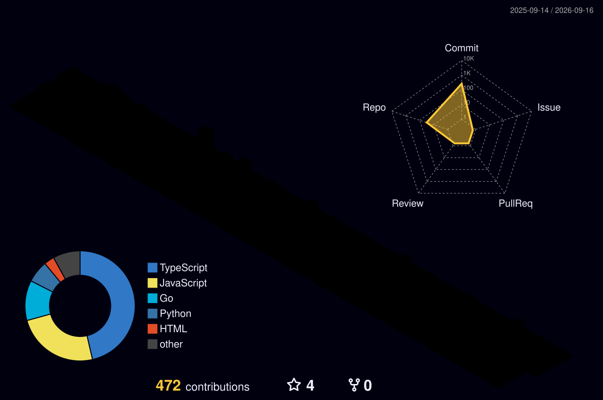

<!-- ─────────────────────────  HEADER  ───────────────────────── -->

 

---

<!-- ─────────────────────────  ABOUT  ───────────────────────── -->
<table>
<tr>
<td width="55%" valign="top">

### 👨‍💻 Tentang Saya

Saya membangun **sistem yang dipakai orang beneran** — bukan cuma proyek portofolio.
Fokus di backend yang rapi, arsitektur yang bisa dirawat, dan UX yang tidak bikin
pengguna berpikir dua kali.

- 🏗️ **Backend & arsitektur** — Laravel, Go Fiber, Next.js App Router
- 📱 **Mobile** — Kotlin Compose, Flutter
- ☁️ **Infra** — Cloud Run, Vercel, Docker, PostgreSQL
- 🧪 Lagi dalami: sistem terdistribusi, AI tooling, data engineering
- 🎓 Mahasiswa Teknologi Sains Data, Universitas Airlangga

</td>
<td width="45%" valign="top">

### ⚡ Prinsip Kerja

| | |
|:--|:--|
| 💡 | **Ide → produksi.** Kalau tidak dipakai, belum selesai. |
| ⚙️ | **Arsitektur bersih.** Modular, mudah diubah orang lain. |
| 🎨 | **User-first.** Fitur mengikuti kebutuhan, bukan sebaliknya. |
| 🔁 | **Iterasi.** Rilis kecil, sering, terukur. |

</td>
</tr>
</table>

---

<!-- ─────────────────────────  STACK  ───────────────────────── -->

### 🛠️ Tech Stack

**Backend & Language**

**Frontend & Mobile**

**Data & Infra**

---

<!-- ─────────────────────────  CONTRIBUTIONS  ───────────────────────── -->

### 🧊 Kontribusi dalam 3D

### 🐍 Snake Eats My Contributions

<!--
  DARK-MODE SNAKE — aktifkan setelah workflow "Generate Snake" jalan sekali.
  Jalankan manual: Actions → Generate Snake → Run workflow.
  Setelah file -dark.svg ada di branch `output`, ganti  di atas dengan blok ini:

  <picture>
    <source media="(prefers-color-scheme: dark)" srcset="https://raw.githubusercontent.com/Ahmadlazim-03/Ahmadlazim-03/output/github-contribution-grid-snake-dark.svg" />
    
  </picture>
-->

Kedua gambar di atas di-generate GitHub Actions ke repo ini sendiri — tidak bergantung layanan pihak ketiga yang bisa mati.

---

<!-- ─────────────────────────  STATS  ───────────────────────── -->

<b>📊 Statistik GitHub</b> — klik untuk buka

 

---

<!-- ─────────────────────────  PROJECTS  ───────────────────────── -->
### 🚀 Yang Sedang & Sudah Saya Bangun

<b>🏭 Sistem produksi</b> — dipakai pengguna nyata

 

| Sistem | Ringkasan | Stack |
|:--|:--|:--|
| **Start Franchise**   `startfranchise.id` | Platform marketplace & SaaS franchise: CMS internal, dashboard member, CRM lead, marketplace merchant, checkout pembayaran, dashboard analitik. | Next.js · Supabase · Tripay · Vercel |
| **Start Franchise API**   `api.startfranchise.id` | REST API v1 untuk aplikasi mobile — auth, katalog, lead, notifikasi. Deploy di Cloud Run. | Go Fiber · PostgreSQL · Cloud Run |
| **Start Franchise Mobile** | Aplikasi Android native, konsumsi API di atas. | Kotlin · Jetpack Compose |
| **Kimaya** | Sistem operasional & disiplin staf untuk bisnis spa — absensi, reminder, reporting. | Next.js · Supabase · PWA |

<b>⚙️ Backend & sistem terdistribusi</b>

 

| Repo | Ringkasan | Bahasa |
|:--|:--|:--|
| [**Implementation-Full-Microservice**](https://github.com/Ahmadlazim-03/Implementation-Full-Microservice) | Implementasi arsitektur microservice lengkap. | Go |
| [**Go-Fiber-Advanced-Backend**](https://github.com/Ahmadlazim-03/Go-Fiber-Advanced-Backend) | Pola backend lanjutan dengan Go Fiber. | Go |
| [**Project-UAS-Advanced-Backend**](https://github.com/Ahmadlazim-03/Project-UAS-Advanced-Backend) | Proyek backend tingkat lanjut. | JavaScript |
| [**database-manager**](https://github.com/Ahmadlazim-03/database-manager) | Antarmuka pengelola database. | Svelte |
| [**Configuration-open-admin-panel-laravel-11**](https://github.com/Ahmadlazim-03/Configuration-open-admin-panel-laravel-11) | Konfigurasi admin panel siap pakai untuk Laravel 11. | PHP |

<b>📱 Mobile, AI & eksperimen</b>

 

| Repo | Ringkasan | Bahasa |
|:--|:--|:--|
| [**Cloud-Computing-Project-Android-Map-Directory**](https://github.com/Ahmadlazim-03/Cloud-Computing-Project-Android-Map-Directory) | Direktori berbasis peta — proyek cloud computing. | Kotlin |
| [**AI-Agent-Desktop**](https://github.com/Ahmadlazim-03/AI-Agent-Desktop) | Agen AI untuk desktop. | Python |
| [**AI-Workforce-Platform**](https://github.com/Ahmadlazim-03/AI-Workforce-Platform) | Platform tenaga kerja berbasis AI. | — |
| [**spotify-mood-analysis**](https://github.com/Ahmadlazim-03/spotify-mood-analysis) | Analisis mood dari data mendengarkan Spotify. | TypeScript |
| [**Moka-POS-Integration-Application**](https://github.com/Ahmadlazim-03/Moka-POS-Integration-Application) | Integrasi dengan Moka POS. | TypeScript |
| [**Mobile-Flutter-My-Code**](https://github.com/Ahmadlazim-03/Mobile-Flutter-My-Code) | Kumpulan kerja Flutter. | Dart |
| [**Regresi-Machine-Learning**](https://github.com/Ahmadlazim-03/Regresi-Machine-Learning) | Eksplorasi model regresi. | Python |

<b>💡 Aplikasi & web lainnya</b>

 

| Repo | Ringkasan | Bahasa |
|:--|:--|:--|
| [**FinWise**](https://github.com/Ahmadlazim-03/FinWise) | Aplikasi manajemen keuangan. | JavaScript |
| [**GoExplore-App**](https://github.com/Ahmadlazim-03/GoExplore-App) | Aplikasi eksplorasi tempat. | CSS |
| [**Recommendation-Book-System-Application**](https://github.com/Ahmadlazim-03/Recommendation-Book-System-Application) | Sistem rekomendasi buku. | TypeScript |
| [**Kimaya-Application**](https://github.com/Ahmadlazim-03/Kimaya-Application) | Aplikasi operasional Kimaya. | JavaScript |
| [**mncatering**](https://github.com/Ahmadlazim-03/mncatering) | Situs layanan katering. | CSS |
| [**dashboard-admin-workshop-ui**](https://github.com/Ahmadlazim-03/dashboard-admin-workshop-ui) | UI dashboard admin workshop. | TypeScript |

Lihat <a href="https://github.com/Ahmadlazim-03?tab=repositories">semua repositori →</a>

---

<!-- ─────────────────────────  CONTACT  ───────────────────────── -->

### 🤝 Mari Terhubung

  

<i>Terbuka untuk kolaborasi, freelance, dan diskusi soal arsitektur backend.</i>

